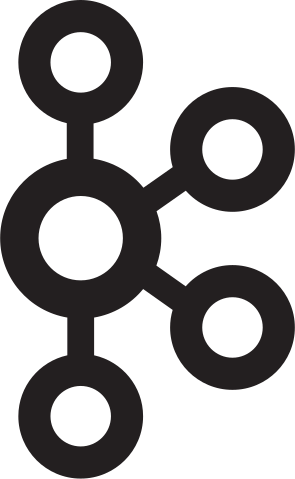

:information_source: &nbsp;Hi, I am Sabir 

:bar_chart: &nbsp; I am Devops Engineer from Pune, India

:warning: &nbsp;Find Out More about me

:stop_sign: &nbsp; Here I have added My all Details

:pencil: &nbsp; find my projects

****

<!-- ALL-TOPICS-LIST:START -->
<!-- prettier-ignore-start -->
<!-- markdownlint-disable -->

<table>
  <tr>
    <td align="center"> <b>DevOps</b></a></td>
    <td align="center"> <b>CI/CD</b></a></td>
    <td align="center"> <b>Git</b></a></td>
    <td align="center"> <b>Ansible</b></a></td>
    <td align="center"> <b>Networking Basic</b></a></td>
   </tr>
  
  <tr>
    <td align="center"></td>
    <td align="center"> <b>Python</b></a></td>
    <td align="center"> <b>Go</b></a></td>
    <td align="center"> <b>Shell Scripting</b></a></td>
    <td align="center"> <b>Kubernetes</b></a></td>
 
  </tr>
  <tr>
    <td align="center">:stop_sign: &nbsp; Here I have added My all Details</td>
    <td align="center"> <b>AWS</b></a></td>
    <td align="center"></td>
    <td align="center"> <b>Google Cloud Platform</b></a></td>
    <td align="center"></td>
    
  </tr>
  <tr>
    
  </tr>
  
  <tr>
    <td align="center"></td>
    <td align="center"> <b>Containers</b></a></td>
    <td align="center"> <b>SQL</b></a></td>
    <td align="center"></td>
    <td align="center"></td>
  </tr>
  <tr>
      <td align="center"> <b>Terraform</b></a></td>
      <td align="center"></td>
      <td align="center"</td>
      <td align="center"></td>
      <td align="center"></td>
  </tr>
  <tr>
      <td align="center"></td>
      <td align="center"> <b>Argo</b></a></td>
      <td align="center"> <b>Kafka</b></a></td>
      <td align="center">< <b></b></a></td>
      <td align="center"></td>
  </tr>
   <tr>
    <td align="center"> <b>Linux</b></a></td>
    <td align="center"> <b>Prometheus</b></a></td>
    <td align="center"></td>
    <td align="center"></td>
    <td align="center"> <b>Security</b></a></td>
   </tr>
   <tr>
    <td align="center"></td>
    <td align="center"></td>
   </tr>
   
</table>

<!-- markdownlint-enable -->
<!-- prettier-ignore-end -->
<!-- ALL-TOPICS-LIST:END -->

<iframe frameborder="0" style="width:100%;height:81px;" src="https://viewer.diagrams.net/?tags=%7B%7D&highlight=0000ff&edit=_blank&layers=1&nav=1#RjZRRb6MwDIB%2FDY%2BrCCmjfWzo1k26k06adHe6l1MGKWQLGIUw6P36c0pooTBpLYj4sx0bE9ujcdEdNK%2Fy75AK5QV%2B2nl07wUB8ekGH5acehJG2x5kWqbO6Ape5D8xeDrayFTUE0MDoIyspjCBshSJmTCuNbRTsyOoadSKZ2IGXhKu5vSXTE3e003oX%2FmTkFk%2BRCa%2B0xR8MHagznkK7QjRB4%2FGGsD0q6KLhbLFG%2BrS%2Bz1%2Bor0kpkVpvuJwejrIO73dZtnPt9Zfs%2FDw%2B8%2Bd2%2BWDq8a9sEvWnIYK1O%2FCJPZVfI%2ByCmRpziUNGV4YMe7vEE1jS1ZBuACXWDSHZG6GD7IU4RYusWgOydzMSkPWU7jEonCe8a03WfAmN954UQaNUbIU8eXw2hofoTQxKNDn%2BlP8P9ovyjLNUykmuvWOBdvdSLeXGjeSUKK%2BBG2PIDtKpUY%2BhNzv8eNRVhsN72KkOZ5%2FqEl5nYvUpfMhtJHYEN%2F4q1A%2FoJZu%2B1cwBoqRwU7JzCoMVEi5kxLMSmAAlptCoUzcG7pWJ8EguxNnQ%2FK66stxlJ3Ng2HvVFZZdJkdMyve1uuVFjU0OhHPic2HodivplYJjqSs0c1fG8iddkxYdJ%2B2Ebk0J041AYUw%2BoQmzoFuXD%2B7gRbcO7m9jofIDb18NBkGxt1Ayi47X3sWF65tB%2FE6Hs660ZClD%2F8B"></iframe>
