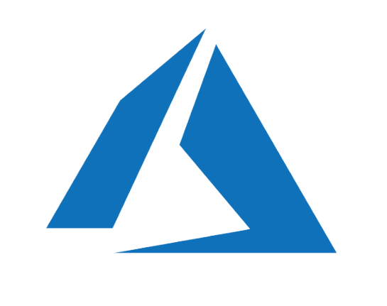
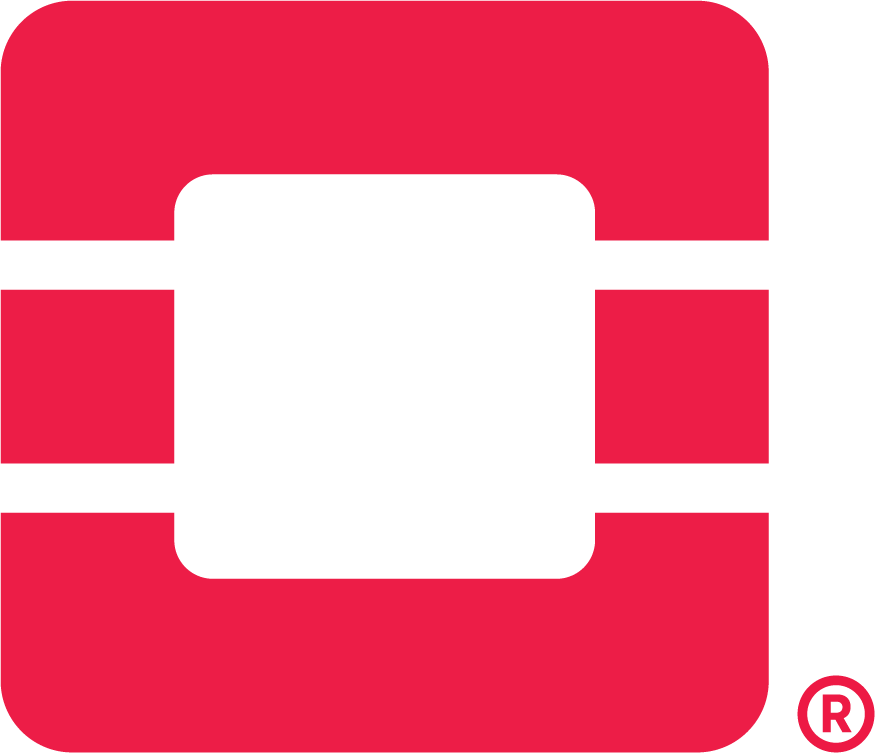
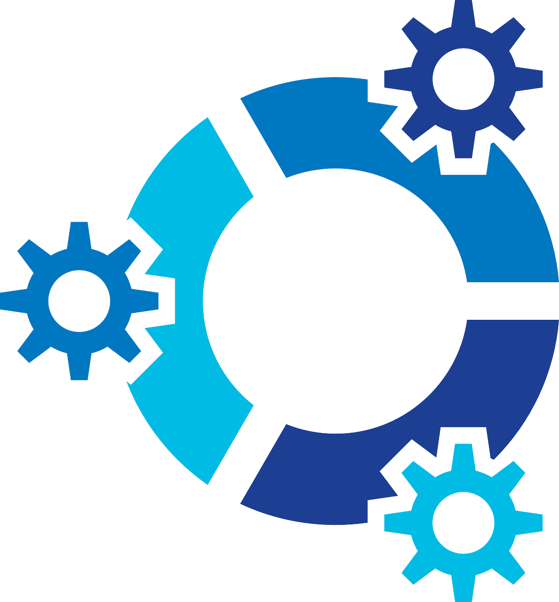
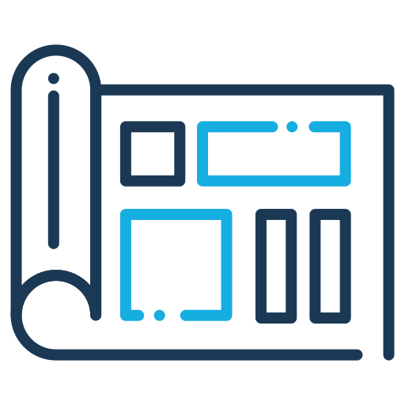
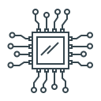
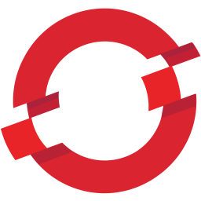

:information_source: &nbsp;Welcome to my Profile 

:bar_chart: &nbsp; I am Devops Engineer form Pune, India

:warning: &nbsp;Find Out More about me

:stop_sign: &nbsp; Here I have added My all Details

:pencil: &nbsp; find my projects

****

<!-- ALL-TOPICS-LIST:START -->
<!-- prettier-ignore-start -->
<!-- markdownlint-disable -->

<table>
  <tr>
    <td align="center"><a href="topics/devops"> <b>DevOps</b></a></td>
    <td align="center"><a href="topics/cicd"> <b>CI/CD</b></a></td>
    <td align="center"><a href="topics/git"> <b>Git</b></a></td>
    <td align="center"><a href="topics/ansible"> <b>Ansible</b></a></td>
    <td align="center"><a href="#network"> <b>Network</b></a></td>
   

  </tr>
  <tr>
    <td align="center"><a href="topics/software_development"> <b>Software Development</b></a></td>
    <td align="center"><a href="https://github.com/bregman-arie/python-exercises"> <b>Python</b></a></td>
    <td align="center"><a href="https://github.com/bregman-arie/go-exercises"> <b>Go</b></a></td>
    <td align="center"><a href="topics/shell"> <b>Shell Scripting</b></a></td>
    <td align="center"><a href="topics/kubernetes"> <b>Kubernetes</b></a></td>
 
  </tr>
  <tr>
    <td align="center"><a href="topics/cloud"> <b>Cloud</b></a></td>
    <td align="center"><a href="topics/aws"> <b>AWS</b></a></td>
    <td align="center"><a href="topics/azure"> <b>Azure</b></a></td>
    <td align="center"><a href="topics/gcp"> <b>Google Cloud Platform</b></a></td>
    <td align="center"><a href="#openstack"> <b>OpenStack</b></a></td>
  </tr>
  <tr>
    <td align="center"><a href="#operating-system"> <b>Operating System</b></a></td>
    <td align="center"><a href="#monitoring"> <b>Monitoring</b></a></td>
    <td align="center"><a href="#elastic"> <b>Elastic</b></a></td>
    <td align="center"><a href="#virtualization"> <b>Virtualization</b></a></td>
    <td align="center"><a href="topics/dns"> <b>DNS</b></a></td>
  </tr>
  <tr>
    <td align="center"><a href="#testing"> <b>Testing</b></a></td>
    <td align="center"><a href="#databases"> <b>Databases</b></a></td>
    <td align="center"><a href="#regex"> <b>Regex</b></a></td>
    <td align="center"><a href="#system-design"> <b>System Design</b></a></td>
    <td align="center"><a href="#hardware"> <b>Hardware</b></a></td>
  </tr>
  <tr>
    <td align="center"><a href="#certificates"> <b>Certificates</b></a></td>
    <td align="center"><a href="topics/containers"> <b>Containers</b></a></td>
    <td align="center"><a href="#sql"> <b>SQL</b></a></td>
    <td align="center"><a href="topics/openshift"> <b>OpenShift</b></a></td>
    <td align="center"><a href="#storage"> <b>Storage</b></a></td>
  </tr>
  <tr>
      <td align="center"><a href="topics/terraform"> <b>Terraform</b></a></td>
      <td align="center"><a href="#mongo"> <b>Mongo</b></a></td>
      <td align="center"><a href="#puppet"> <b>Puppet</b></a></td>
      <td align="center"><a href="#distributed"> <b>Distributed</b></a></td>
      <td align="center"><a href="#questions-you-ask"> <b>Questions you can ask</b></a></td>
  </tr>
  <tr>
      <td align="center"><a href="topics/circleci"> <b>Circle CI</b></a></td>
      <td align="center"><a href="topics/argo"> <b>Argo</b></a></td>
      <td align="center"><a href="topics/kafka"> <b>Kafka</b></a></td>
      <td align="center"><a href="topics/datadog"> <b></b></a></td>
      <td align="center"><a href="topics/perl"> <b>Perl</b></a></td>
  </tr>
   <tr>
    <td align="center"><a href="topics/linux"> <b>Linux</b></a></td>
    <td align="center"><a href="#prometheus"> <b>Prometheus</b></a></td>
    <td align="center"><a href="#big-data"> <b>Big Data</b></a></td>
    <td align="center"><a href="topics/soft_skills"> <b>Soft Skills</b></a></td>
    <td align="center"><a href="topics/security"> <b>Security</b></a></td>
   </tr>
   <tr>
    <td align="center"><a href="topics/chaos_engineering"> <b>Chaos Engineering</b></a></td>
    <td align="center"><a href="#Misc"> <b>Misc</b></a></td>
   </tr>
   
</table>

<!-- markdownlint-enable -->
<!-- prettier-ignore-end -->
<!-- ALL-TOPICS-LIST:END -->

## Certificates

If you are looking for a way to prepare for a certain exam this is the section for you. Here you'll find a list of certificates, each references to a separate file with focused questions that will help you to prepare to the exam. Good luck :)

#### AWS

* [Cloud Practitioner](certificates/aws-cloud-practitioner.md) (Latest update: 2020)
* [Solutions Architect Associate](certificates/aws-solutions-architect-associate.md) (Latest update: 2021)
* [Cloud SysOps Administration Associate](certificates/aws-cloud-sysops-associate.md) (Latest update: Oct 2022)

#### Azure

* [AZ-900](certificates/azure-fundamentals-az-900.md) (Latest update: 2021)

#### Kubernetes

* [Certified Kubernetes Administrator (CKA)](topics/kubernetes/CKA.md) (Latest update: 2022)

## Additional DevOps and SRE Projects

